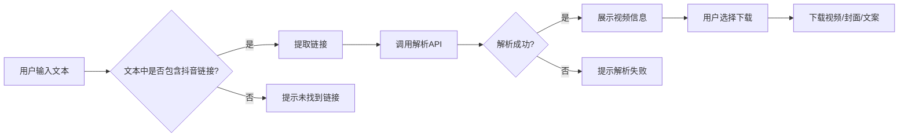

## 1. Product Overview
抖音视频链接解析网站，帮助用户从文本中自动提取抖音视频链接，获取视频、封面和文案并提供下载功能。

- **核心功能**：解析抖音链接、获取视频信息、提供下载服务
- **目标用户**：需要下载抖音视频的普通用户、内容创作者
- **市场价值**：简化抖音视频下载流程，无需安装APP即可获取视频资源

## 2. Core Features

### 2.1 User Roles
| Role | Registration Method | Core Permissions |
|------|---------------------|------------------|
| 普通用户 | 无需注册 | 解析链接、查看视频信息、下载视频/封面/文案 |

### 2.2 Feature Module
1. **主页**：输入框、解析按钮、结果展示区、下载按钮
2. **解析功能**：自动识别文本中的抖音链接、调用API获取视频信息
3. **下载功能**：视频下载、封面下载、文案复制

### 2.3 Page Details
| Page Name | Module Name | Feature description |
|-----------|-------------|---------------------|
| 主页 | 输入区域 | 用户输入包含抖音链接的文本 |
| 主页 | 解析按钮 | 触发链接解析和视频信息获取 |
| 主页 | 结果展示 | 展示视频封面、文案、视频预览 |
| 主页 | 下载区域 | 提供视频、封面、文案的下载/复制按钮 |

## 3. Core Process
用户在输入框中粘贴包含抖音链接的文本 → 点击解析按钮 → 系统自动提取链接 → 调用API获取视频信息 → 展示视频封面、文案和视频预览 → 用户选择下载视频、封面或复制文案

## 4. User Interface Design

### 4.1 Design Style
- **主色调**：抖音红 #fe2c55
- **辅助色**：白色、深灰色背景
- **按钮风格**：圆角矩形、渐变色、悬停效果
- **字体**：简洁现代的无衬线字体
- **布局**：卡片式布局、居中对齐
- **图标**：简洁线条风格

### 4.2 Page Design Overview
| Page Name | Module Name | UI Elements |
|-----------|-------------|-------------|
| 主页 | 头部 | Logo、标题、简短描述 |
| 主页 | 输入区域 | 大尺寸文本输入框、解析按钮 |
| 主页 | 结果展示 | 视频封面图、视频预览、文案展示 |
| 主页 | 下载区域 | 三个下载按钮（视频、封面、文案） |

### 4.3 Responsiveness
- **桌面端**：完整功能展示，输入框和结果并排或上下排列
- **移动端**：响应式布局，元素垂直堆叠，触摸友好的按钮尺寸

### 4.4 3D Scene Guidance
无需3D场景