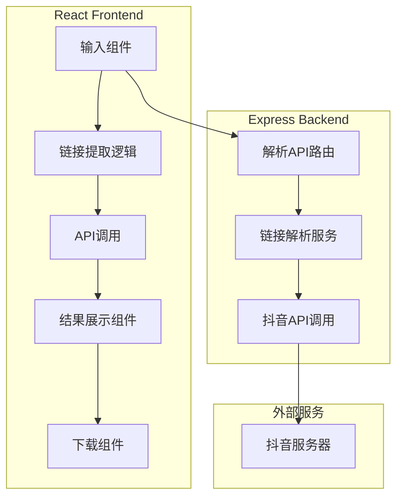
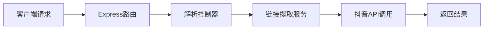

## 1. Architecture Design


## 2. Technology Description
- **Frontend**: React@18 + TypeScript + TailwindCSS@3 + Vite
- **Initialization Tool**: vite-init
- **Backend**: Express@4 + TypeScript
- **Database**: 无需数据库（无持久化需求）

## 3. Route Definitions
| Route | Purpose |
|-------|---------|
| / | 主页，包含输入框和解析功能 |

## 4. API Definitions

### 4.1 解析抖音链接
- **Endpoint**: `POST /api/parse`
- **Request**:
```typescript
interface ParseRequest {
  text: string; // 用户输入的文本
}
```
- **Response**:
```typescript
interface ParseResponse {
  success: boolean;
  message?: string;
  data?: {
    videoUrl: string;      // 视频下载链接
    coverUrl: string;      // 封面图片链接
    caption: string;       // 视频文案
    title?: string;        // 视频标题
    author?: string;       // 作者信息
  };
}
```

### 4.2 健康检查
- **Endpoint**: `GET /api/health`
- **Response**:
```typescript
interface HealthResponse {
  status: 'ok';
  timestamp: number;
}
```

## 5. Server Architecture Diagram


## 6. Data Model
无需数据库，所有数据均为临时处理